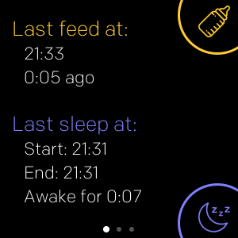
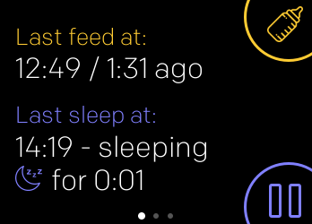
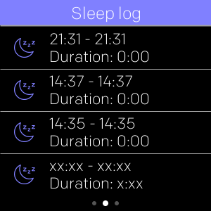
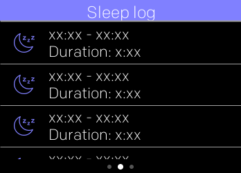
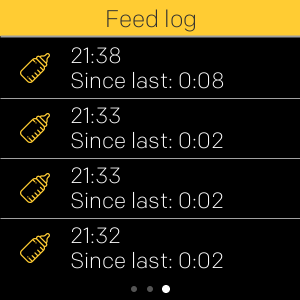
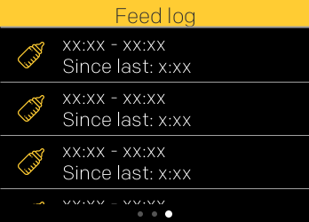

# BabyLog

A FitBit Smartwatch app to track in a very simplistic way when your baby slept or ate the last time.
Swipe left/right to change the screens.
Tap on any of the times on the main screen to modify manually the currently logged feed / sleep times.

## Active feed / sleep

- VERSA:

- IONIC:

The display shows several data:

- the last time you logged a baby feed time
- the elapsed time since the last logged feed
- the last time the baby started a sleep
- the last time the baby ended a sleep
- the elapsed time since the baby started or ended a sleep depending if it is currently still sleeping

The data is stored on your smartwatch.

You can log a feed by the upper right combo button.
You can start / end a sleep log by the lower right combo button.

## Sleep log

- VERSA:

- IONIC:

The last ten log entries are stored on the device:

- start and end time of the sleep
- the duration

## Feed log

- VERSA:

- IONIC:

The last ten log entries are stored on the device:

- time of the feed
- the time elapsed since the last feed before

## Disclaimer

I wrote this very quickly for exactly my needs.

If you want further or modified behaviour, feel free to built on my simple code that can be found at
[GitHub](https://github.com/tanstaaflFH/BabyLog)

Support me with a donation at [paypal.me](https://paypal.me/FHDevelopment?locale.x=de_DE) if you like.

## Changelog

Can be found here:
[Changelog](https://github.com/tanstaaflFH/BabyLog/blob/master/CHANGELOG.md)
